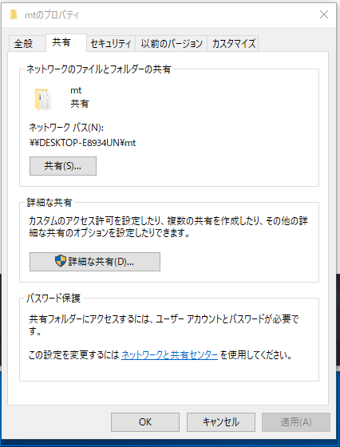

Movable Type用Dockerファイル
---


# 概要

ベースとなるOSは、Ubuntu 17.10です。

Movable Typeを動作させるためのApache,MySQL,ImageMagick,各種CPANファイル
などを組み込んだDockerfileです。

Movable Type本体は入っていません.

ローカル環境にMTを入れて、Docker環境にマウントして利用することを想定しています。


docker hubにビルド済みのイメージがあります。こちらを使うときは、

```
$ docker pull knaito/ubuntu_with_mt_env
```

とします。こちらを使う場合は、イメージファイルの作成をスキップし、以後、ubuntu_with_mt_envは、knaito/ubuntu_with_mt_envと読み替えてください。（または、
```
$ docker tag knaito/ubuntu_with_mt_env ubuntu_with_mt_env
```
でタグづけしてください）

なお、ベースになっている`knaito/ubuntu_with_lamp:1.1`のgit repositoryは https://github.com/knight9999/docker_ubuntu_with_lamp です。

[注意]
gitbashの設定で、

```
git config --global core.autoCRLF false
```

などの設定をして、githubからcloneしたテキストコードの改行がCRLFではなくLFになるようにしてください。
さもないと、buildしたときに、改行コードがCRLFしたものが組み込まれていまい、ビルドエラーになります。


# 使い方

## イメージファイルの作成

`git clone`したディレクトリ(Dockerfileが存在するディレクトリ)に移動して、以下を実行します。

```
$ docker build -t ubuntu_with_mt_env .
```

これで、ローカルにubuntu_with_mt_envイメージが作成されます。(名前は `ubuntu_with_mt_env`でなくても、なんでも構いません)

## MySQL用のボリュームの用意

例えば、`mt-storage`という名前のボリュームを作成するのであれば、

```
$ docker volume create mt-storage
```

確認

```
$ docker volume ls
```

削除

```
$ docker volume rm mt-storage
```

## コンテナの起動

### Macの場合

例えば、`mt_server`という名前のコンテナを作成するのであれば、次のようにします。

```
$ docker run --privileged -d --name mt_server -p 8080:80 -v /path/to/shared/directory:/var/mt/ -v mt-storage:/var/db/mysql  -it ubuntu_with_mt_env
```

ここで、/path/to/shared/directoryは、マウントするディレクトリです。このディレクトリの下にwwwディレクトリが（もしなければ）作成され、以後、Apacheによりマウントされます。

macであれば`pwd`を使って

```
$ docker run --privileged -d --name mt_server -p 8080:80 -v `pwd`/mt:/var/mt/ -v mt-storage:/var/db/mysql  -it ubuntu_with_mt_env
```

ともできます。また、上記ではmt-storageというボリュームをコンテナ内の/var/db/mysqlにマウントしていますが、macの場合、mysqlのボリュームを直接ディレクトリにマウントしてもOKです。
その場合は、例えば自分のローカルにmysqlというディレクトリを作成して

```
$ docker run --privileged -d --name mt_server -p 8080:80 -v `pwd`/mt:/var/mt/ -v `pwd`/mysql:/var/db/mysql  -it ubuntu_with_mt_env
```

のようにします。

### Windowsの場合

windowsの場合は、ディレクトリをマウントするとコンテナ側で権限が0755となってしまうため、上記の方法は使えません。そこで、次のようにwww用のボリュームを作成して（ここではmt-wwwとします）、

mysqlのボリュームmt-storageとともにマウントします。

```
$ docker volume create mt-www
```

また、設定用のファイルであるmt-etcも作成しておきます。

```
$ docker volume create mt-etc
```

(mt-etcはmt側から上書きしないので、直接Windowsフォルダをマウントしても良いのですが、Dockerの設定をしなくてはいけないなどちょっと面倒なので、ここでは作成しています)

```
$ docker run --privileged -d --name mt_server -p 8080:80 -v mt-etc:/var/mt/etc -v mt-www:/var/mt/www -v mt-storage:/var/db/mysql  -it ubuntu_with_mt_env
```
etcを書き換える必要がない場合は、マウントしなくてかまいません。ちょっと確認するだけならこれでもOKですが、メールサーバーの設定などが必要になると、etcを書き換えることになるので、マウントして置いた方がオススメです。

```
$ docker run --privileged -d --name mt_server -p 8080:80 -v mt-www:/var/mt/www -v mt-storage:/var/db/mysql  -it ubuntu_with_mt_env
```

mtの本体をボリュームにコピーする

```
$ docker cp MT-7.0a2 mt_server:/var/mt/www/mt
```

この後、通常のMTと同じように権限を設定します。

```
$ docker exec -it mt_server bash
```

linuxコマンドを叩いて、権限を設定してください。


### Windows側の共有ファイルを共有する場合（Deprecated)

mt-wwwのようなボリュームを作成せず、windows側で作成したフォルダを共有する場合。

docker runのときに、/var/mt/wwwには何もマウントしません。

```
$ docker run --privileged -d --name mt_server -p 8080:80 -v mt-storage:/var/db/mysql  -it ubuntu_with_mt_env
```

そして、Windows側で共有フォルダを作成します。



アクセス許可を設定し、フルコントロールを設定出来るようにしておいてください。

ここで設定した共有ディレクトリは、mtです。このディレクトリの配下にwwwを作成しておきます。
すると、このwwwは、Windows側から `\\localhost\mt\www` でアクセスすることができます。

この状態で、このディレクトリをコンテナ側からマウントするには、次のコマンドを実行します。

```
$ docker exec -it mt_server win-mount ユーザー名　/mt/www
```

( `win-mount` コマンドが何をしているのかは `files/win-mount.bash` を見てください。パラメータを取得して、`mount` コマンドで `cifs` マウントしているだけです)

ここでmt_serverはコンテナ名です。自分の環境に合わせたものにしてください。また、ユーザー名は、共有ディレクトリにアクセスできるユーザー名です。 `/mt/www`は、マウントする対象となるディレクトリです。`\\localhost\mt\www`から、`\\localhost`の部分を除いたものを記述します。

パスワードを聞かれるので、適切に答えると、マウントされます。

マウントを解除するには

```
$ docker exec -it mt_server win-umount
```

を実行します。


現在マウントされているかどうかを確認するには

```
$ docker exec -it mt_server win-checkmount
```

を実行します。

[注意]　この方法は非常に重く、また以下に示す問題を解決出来ていないため、Deprecatedとします。
Windows側のフォルダを共有する方法は、IO制限なのか、MTのpublishがうまくいかない場合があります。
この問題は現在調査中です。

[2018/04/21追記]

MTの中のTheme.pm の install_static_filesの中の

```
    File::Find::find( { wanted => $sub, no_chdir => 1, }, $src );
```
を
```
    File::Find::find( { wanted => $sub, no_chdir => 1, follow => 1, }, $src );
```
と変更すれば、Windowsの共有フォルダに対してもpublishが成功します。

## コンテナへのログイン

次でログインします

```
$ docker exec -it mt_server bash
```


## MTファイルの配置

一番簡単に使うのであれば、コンテナ上のDocument Root /var/mt/wwwの下に(Macであればホスト上のマウントしているディレクトリ`/path/to/shared/directory`の下の`www`の下でも良い。Windowsでは、docker cpコマンドなどでコピーします)、mtファイルの一式を起きます。

ディレクトリ構成は

```
mt
  - www
    - mt
      - mt-config.cgi
      - その他のファイル
      - mt-static
        - support
```
となります。


wwwとmtディレクトリは、読み書き可能にして下さい。(MTをインストール完了後は、mtディレクトリは書き込み不可にしても大丈夫です。いつものmtの設定です)

また、mt-static/supportディレクトリも、読み書き可能にして下さい。


## データベースの準備

最初、自動で空のDBが作成されます。名前はmtdbです。自分でDBを作りたい場合、コンテナにログインして作成してください。mysqlのrootユーザーでパスワードなしで設定されています。

```
$ mysql -u root
> create database データベース名;
> exit
```

## 注意事項

mysqlを起動・終了させるためのユーザーdebian-sys-maintはハードコーディングされているので、変更したい場合は、
files/etc/mysql/debian.cnfを修正し、合わせてfiles/entry-script.bashの中のパスワードも変更してください。

## Postfixの設定

Postfixに必要な設定がある場合は、マウントしているディレクトリ(/path/to/shared/directory)に作られるpostfix以下に
必要なファイル(main.cf)などを置いてください。Dockerコンテナ起動時に、その内容を/etc/postfixにコピーします。
起動時以外には反映されないので注意してください。

### 例：Gmailを中継サーバーに使う。

`/etc/postfix/main.cf` を `/path/to/shared/directory/etc/postfix` にコピー

`main.cf` を編集します。
既存の
```
relayhost =
```
を削除

次を追加

```
# GMail
relayhost = [smtp.gmail.com]:587
smtp_use_tls = yes
smtp_tls_CApath = /etc/ssl/certs
smtp_sasl_auth_enable = yes
smtp_sasl_password_maps = hash:/etc/postfix/sasl_passwd
smtp_sasl_tls_security_options = noanonymous
smtp_sasl_mechanism_filter = plain
```

(centOS系の場合は、
```
smtp_tls_CApath = /etc/ssl/certs
```
の代わりに
```
smtp_tls_CAfile = /etc/pki/tls/certs/ca-bundle.crt
```
らしい
)

コンテナ上で次を実行

```
# vi /etc/postfix/sasl_passwd
```
として、
```
[smtp.gmail.com]:587     <gmail_address>:<password>
```
を書き込む。

として、次を実行

```
# chmod 600 /etc/postfix/sasl_passwd
# postmap hash:/etc/postfix/sasl_passwd
```

postmapコマンドで生成されたsasl_psswd.db
を、/path/to/shared/directory/etc/postfixにコピー

反映させるために、hostに戻って

```
$ docker stop mt_server
$ docker start mt_server
```

## Gmail側で、安全性の低いアプリからのメールを許可する必要がある

以下にアクセスして、安全性の低いアプリを許可しないといけないようです。

https://support.google.com/accounts/answer/6010255?hl=ja


## Apacheの設定

Apacheの設定ファイルである`/etc/apache2/sites-enabled/000-default.conf`
では、cgiが使えるように設定してあります。Document Rootを変更する場合は、適時変更を行ってください。


## コンテナを停止する

```
$ docker stop mt
```

## コンテナを起動する

```
$ docker start mt
```

## ターミナルに接続

```
$ docker exec -it mt bash
```


## MTのインストール

ブラウザから、

```
http://localhost:8080/mt
```

でMTにアクセスしてください。インストールウィザードにしたがって、インストールを行います。

## ChangeLog

- 1.3 For Windows, mount share folder functions.
- 1.2 Based on Ubuntu 17.10. Mysql Volume is separated.
- 1.0 Based on Ubuntu 16.10
